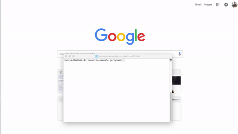

# react-monocle [](https://travis-ci.org/mbchoa/react-monocle)

**React Monocle** is a developer tool for generating visual representations of your React app's component hierarchy.

</br>
<p align="center">

</p>
</br>


### How It Works
React Monocle parses through your React source files to generate a visual tree graph representing your React component hierarchy. 
The tree is then displayed along with a live copy of your application. 
The rendered tree is synced up to the state(s) of your component using Redux, and as the state of your live app changes, the monocle tree graph will also provide visual feedback of data flow and state changes through the React components.

### Setup
1. ```npm install -g react-monocle```
2. Navigate to the directory which contains your html file.
3. Run ```monocle -c <html> -b <bundle>```, where html and bundle are the relative paths to your html and bundle files.
4. If more options are needed (ie if your React files are written in .js instead of .jsx), type ```monocle -h``` for more available options.

### Options
```
-e, --entry <entry>: App entry point. Defaults to JSX file where ReactDOM.render is found.
-d, --directory <directory>: directory of React files. Defaults to where Monocle was called.
-j, --extension <extension>: extension of React files (jsx or js). Defaults to .jsx (only use when specifying/in directory which has your React files!)
```

### License
MIT

Copyright (c) 2016 Michael-Bryant Choa, Jenna Davis, Jerry Mao
